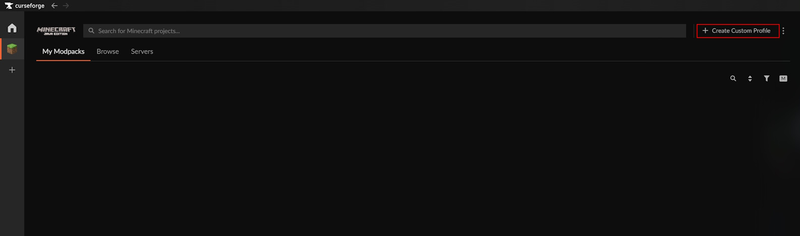
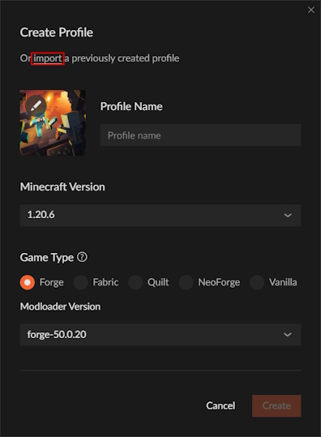
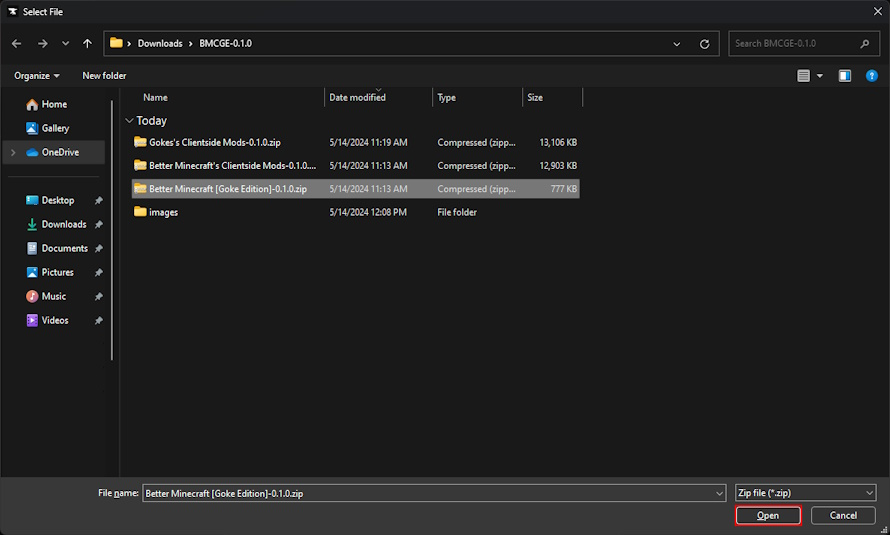
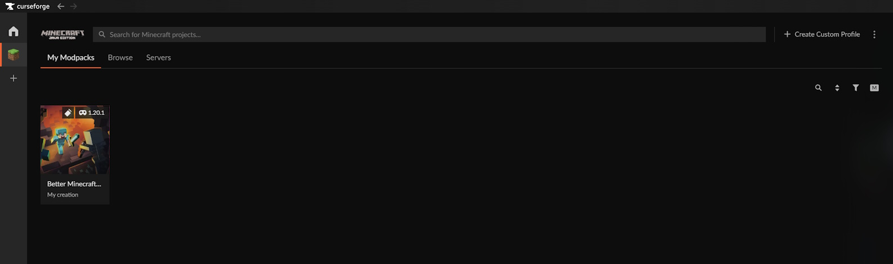
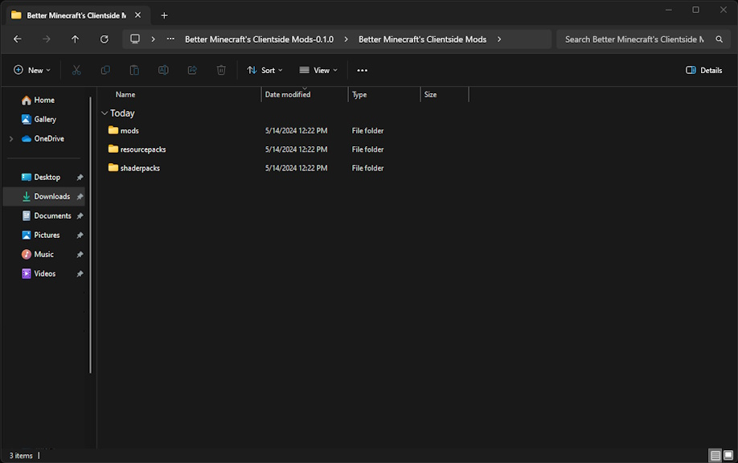
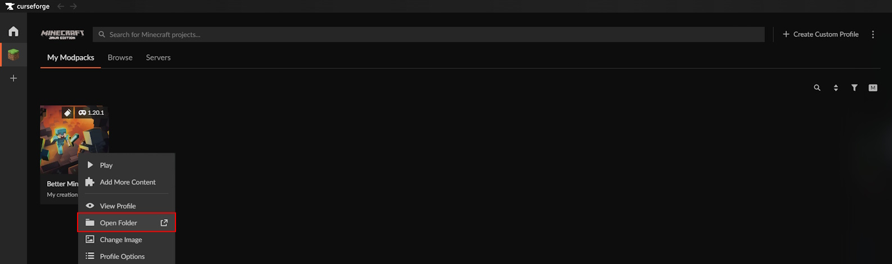
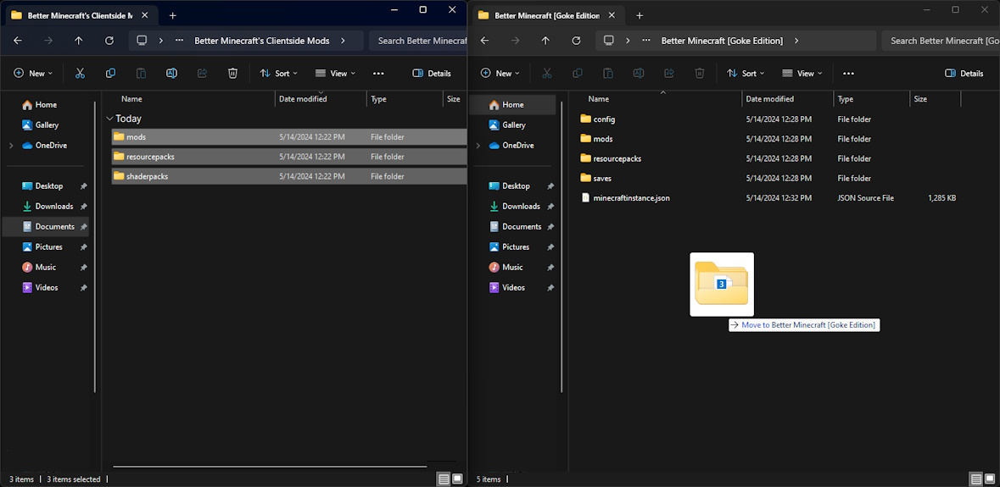

# Better Minecraft, Goke Edition

## The Modpack
This GitHub repository hosts my own take on Luna Pixel's Better Minecraft modpack. Since my server will run with this modpack, this GitHub Repo offers explicit instructions on how to install both my modpack and optional clientside additions.

## What's Included
This GitHub repo contains three important files;
* **Better Minecraft [Goke Edition]** : 
  This is my version of Better Minecraft and should be installed using the CurseForge mod manager.
* **Goke's Clientside Mods** : 
  This is my personal collection of client-side mods, shaders, and texture packs.
* **Better Minecraft's Clientside Mods** : 
  This is a collection of Better Minecraft's original client-side mods, shaders, and texture packs.

The Better Minecraft [Goke Edition] file does not include many client-side mods so the players of the server can choose what mods they want.

## Installation

### Installing Better Minecraft [Goke Edition]
This is the only installation **required** to play on the server.
1. Download and unzip/extract the latest release of BMCGE from this GitHub repository. This will contain five files, we will be working with `Better Minecraft [Goke Edition]-x.x.x.zip`
2. Open the CurseForge app. Click to the "Create Custom Profile" button. The "Create Profile" menu will appear.

3. In the "Create Profile" menu, click the "import" button.

4. Select `Better Minecraft [Goke Edition]-x.x.x.zip` and click open.

5. CurseForge will load the modpack. Once finished, you can begin playing the modpack.

### Installing Client-side Mods
The installation procedure for both `Better Minecraft's Clientside Mods-x.x.x.zip` and `Gokes's Clientside Mods-x.x.x.zip` **are the same**. I will demonstrate the installation procedure with `Better Minecraft's Clientside Mods-x.x.x.zip`.
1. Unzip/extract the chosen client-side mod file. The conents should look something like this;

2. Right-click the "Better MC [Goke Edition]" mod pack in CurseForge and click "Open Folder".

3. Select all of the items in the unzipped/extracted client-side mod folder and drag them into the newly opened `Better MC [Goke Edition]` folder.
  *NOTE: It is okay if the `Better MC [Goke Edition]` folder looks slightly different than the screenshot.*

4. Once the files have been transfered the mod pack can be started with the client-side mods installed.

## Notes
This modpack was created to be used on a single server and does not intend to be modified or distributed by requests external to the server's operation. This modpack was created based on the experience provided by Better Minecraft, created by the Luna Pixel team. This modpack does not seek to capitalize off of the content within and should not be used in any manner breaching the mod makers' intentions.